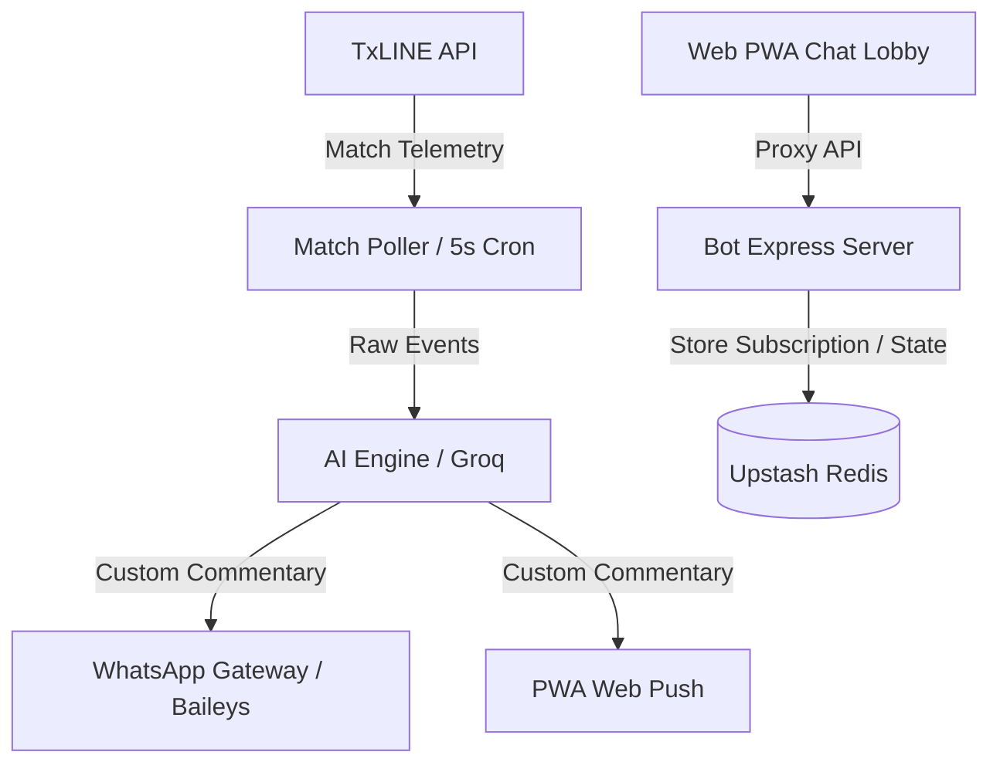

# Huginn Project Blueprint & Technical Reference Manual

Use this file to train any AI model, guide developers, or demonstrate to hackathon evaluators how the Huginn ecosystem is structured, maintained, and operated.

---

## 1. System Architecture Overview

Huginn is split into two primary components:
1. **The Backend Bot Server (`wcbot 2`)**: A Node.js server that runs the WhatsApp client integration (via Baileys), processes real-time match telemetry from the TxLINE API, generates AI commentary using the Groq API, and coordinates web-push subscriptions.
2. **The Web Frontend (`huginn-website-build (1)`)**: A Next.js Web PWA providing a responsive dashboard, live scoreboard, and interactive chat lobby matching the WhatsApp bot's capabilities.

---

## 2. Directory Structure

### 📂 [wcbot 2](file:///Users/1030G2/Documents/Huginn/wcbot%202) (Backend & WhatsApp Bot)
*   [package.json](file:///Users/1030G2/Documents/Huginn/wcbot%202/package.json) - Express, Baileys, Upstash Redis, and Web-Push dependencies.
*   [src/index.js](file:///Users/1030G2/Documents/Huginn/wcbot%202/src/index.js) - App entry point, Express routing, auth persistence export, and cron job scheduling.
*   [src/handlers/chat.js](file:///Users/1030G2/Documents/Huginn/wcbot%202/src/handlers/chat.js) - Handles browser mock chat API, mirroring WhatsApp commands for web users.
*   [src/handlers/webhook.js](file:///Users/1030G2/Documents/Huginn/wcbot%202/src/handlers/webhook.js) - Routes WhatsApp commands (`/follow`, `/live`, `/schedule`, `/style`, `/stats`, `/sweepstake`).
*   [src/handlers/sweepstake.js](file:///Users/1030G2/Documents/Huginn/wcbot%202/src/handlers/sweepstake.js) - Manages group-based sweepstake signups and draws.
*   [src/services/matchPoller.js](file:///Users/1030G2/Documents/Huginn/wcbot%202/src/services/matchPoller.js) - Telemetry poller running every **5 seconds** to detect match events (goals, red cards, HT/FT).
*   [src/services/scheduler.js](file:///Users/1030G2/Documents/Huginn/wcbot%202/src/services/scheduler.js) - Scheduled cron checking for upcoming matches to send **30-minute pre-match bulletins** with odds.
*   [src/services/txline.js](file:///Users/1030G2/Documents/Huginn/wcbot%202/src/services/txline.js) - Client wrapper for the TxLINE API.
*   [src/services/ai.js](file:///Users/1030G2/Documents/Huginn/wcbot%202/src/services/ai.js) - Groq integration generating AI commentary matching user-selected styles.
*   [src/services/pushNotify.js](file:///Users/1030G2/Documents/Huginn/wcbot%202/src/services/pushNotify.js) - Web-push broker for browser push notifications.
*   [src/utils/db.js](file:///Users/1030G2/Documents/Huginn/wcbot%202/src/utils/db.js) - Upstash Redis integration for stateless data persistence (subscribers, followed teams).
*   [demo_live.mjs](file:///Users/1030G2/Documents/Huginn/wcbot%202/demo_live.mjs) - Real-time, wall-clock match simulator used to test and demo the entire system offline.

### 📂 [huginn-website-build (1)](file:///Users/1030G2/Documents/Huginn/huginn-website-build%20%281%29) (Next.js Frontend & PWA)
*   `app/live-chat/page.tsx` - Main PWA layout, live scoreboard panel, and interactive chat interface.
*   `app/api/chat/route.ts` - Edge API proxy route sending chat requests to the bot server.
*   `app/api/live/route.ts` - Edge API proxy route fetching live scoreboards from the bot server.
*   `app/api/push/subscribe/route.ts` - Edge API proxy registering push notification tokens.

---

## 3. Database Schema & State Sync (`src/utils/db.js` & `src/utils/store.js`)

To enable seamless deployments on serverless hosting like Render, Huginn uses **Upstash Redis** for persistence, making the server completely stateless.

*   `sub:{sessionId}` - Stores web push configurations and user-followed teams.
*   `team:{teamName}:subscribers` - Redis set mapping specific teams to subscribed session IDs for fast fan-out push notifications.
*   `wagroup:{groupId}` - Persists registered WhatsApp group configurations.
*   `matchscore:{matchId}` - Tracks the last seen score, cards, and sent notifications to prevent duplicate alerts during restarts.

---

## 4. Telemetry Processing & AI Commentary

1.  **State Polling**: The bot polls TxLINE's `/fixtures/snapshot` endpoint every 5 seconds.
2.  **Diff Validation**: When a goal, card, or match status change is detected, the event is passed to `ai.js`.
3.  **AI Style Enforcement**: Groq generates commentary based on the target group's style:
    *   `hype`: High-energy, emoji-heavy stadium announcer style.
    *   `tactical`: Analytical, formation, and manager-centric analysis.
    *   `funny`: Lighthearted jokes, banter, and references.
    *   `balanced`: Neutral, informative summary.
4.  **Formatting Rules**:
    *   Sentence-case formatting.
    *   Paragraph separation with double newlines (`\n\n`) for optimal readability on mobile screens.
    *   Opening odds included dynamically in pre-match announcements.

---

## 5. Security & Maintenance

*   **Auth Export (`/api/wa-auth-export`)**: Allows developers to export the Baileys session credentials after a single QR code scan, avoiding repeat scans after container restarts.
*   **Wipe Endpoint (`POST /api/reset-follow-state`)**: Wipes active Redis states and local memory to cleanly reset the database before new match weeks. Guarded by a secure `RESET_SECRET` bearer token.
